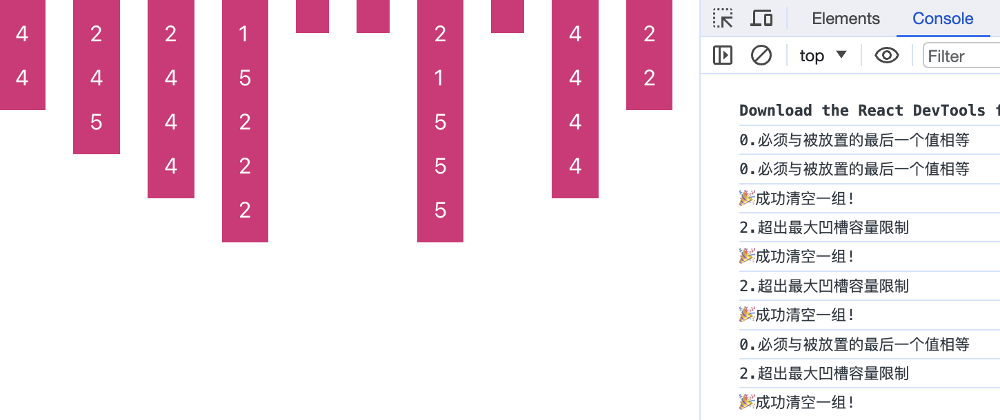

# MindStake
A mind-blowing puzzle game <br>
这是一款基于颜色分类和堆叠的益智游戏
#### 最终效果图例子


- 游戏机制：游戏开始时随机生成多个硬币槽，每个槽可以放置3-8个硬币。这需要一个随机化系统来确保每次游戏开始时硬币槽和硬币的分布都是随机的。
- 玩家操作：玩家的任务是将硬币按颜色分类，将同色硬币堆放在一起。这需要一个直观的用户界面，玩家可以轻松地拖放硬币。
- 消除和得分：当一个硬币槽被同色硬币堆满时，该槽消除并给玩家加分。得分系统需要根据消除硬币槽的数量和速度来设计。
- 游戏难点：如果硬币槽被堆满但颜色不一致，则玩家失败。这就要求玩家策略地移动硬币，考虑每一步的后果。

#### 开发框架选择
- [ ] ```Phaser```
- [ ] ```PixiJS```
- [ ] ```ThreeJS```
- [ ] ```纯原生(DOM或Canvas)```


#### 开发任务
- [ ] 选择开发框架初始化项目
- [ ] 构建游戏逻辑
- [ ] 构建基础界面
- [ ] 数据存储方案
- [ ] ...
- [ ] 上线


## 开发记录
```2023/12/11```<br>
基础逻辑写入<br>

